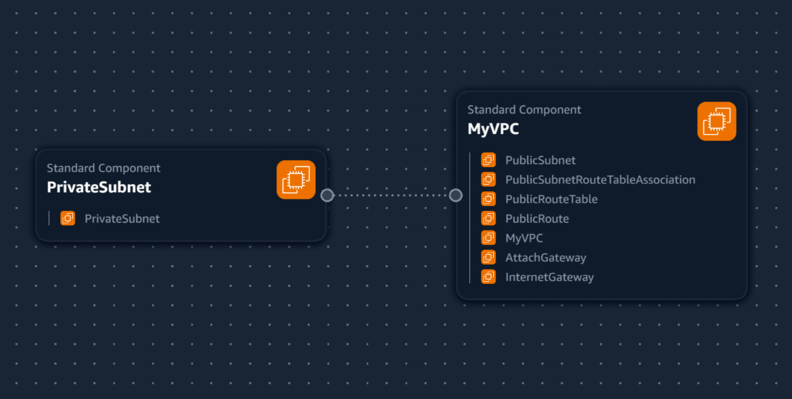

## VPC Settings

These are the VPC Settings we observed Tim setup for our cloud environment in AWS:

- VPC IPv4 CIDR Block: 10.200.123.0/24
- IPV6 CIDR Block: No
- Number of AZs: 1
- Number of Private Subnets: 1
- Number of Public Subnets: 1
- NAT Gateways: None
- VPC Endpoints: None
- DNS Options: Enable DNS Hostnames
- DNS Options: Enable DNS Resolution

## Generated and Reviewed CFN Template

Watching the instructors' videos, I noted the VPC Settings, provided this to an LLM to produce the CFN to automate the provision of the VPC infrastructure. 

- I asked the LLM to refactor the parameters so that it would not hardcode values and the template is more reusable. 

## Generated Deploy Script

Using ChatGPT, generated a a bash script `bin/deploy`

I changed the shebang to work for all OS platforms.

## Visualization in Infrastructure Composer

I thought maybe we could visualize our VPC via Infrastructure Composer but it's not the best representation.

## Installing AWS CLI

In order to deploy via the AWS CLI, we need to install it. 

We follow the install instructions: https://docs.aws.amazon.com/cli/latest/userguide/getting-started-install.html